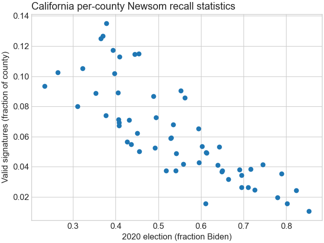

# Analysis of Newsom recall signatures by county

This repository contains a collection of data sources and 
scripts necessary to do an analysis of the relationship between 
signatories for the Newsom recall and performance in the 2020 election. 

This also contains relatively generic code for producing a 
political heatmap from a geoJSON file (?) assuming this is a 
relatively standardized format (see `load_geometry.py` for function).

## Basic structure:
* `newsom_differential_map.py`

* `load_election.py`
* `load_geometry.py`
* `load_county_populations.py`
* `load_recall_counts.py`

## Necessary packages:
* numpy
* pandas
* matplotlib (probably version 3+)

## Sources:
* See `sources.txt` for a brief description with links.